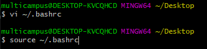

# Jupyter Notebook


## 1. Jupyter Notebook 설치

> cmd - pip install jupyter

pip list를 통해 설치 확인

```bash
Package            Version
------------------ ----------
jupyter            1.0.0
```


## 2. Jupyter Notebook 실행

> git bash 창에서 jupyter notebook 입력
>
> **bash 창 끄지 말 것**


## 3. Jupyter Notebook  단축키 활용

> `ESC + h` 버튼으로 단축키 확인 가능

* b : 새로운 cell 생성 (커맨드 모드)

* m : 마크다운 쓰듯이

* Ctrl + Enter : 현재 셀 실행

* Shift + Enter : 현재 셀 실행 + 다음 셀 선택 (or 없을 경우 셀 생성)

* Alt + Enter : 현재 셀 실행 + 다음 셀 생성

  ...


## 4. Jupyter Notebook  간단하게 실행하기

> 1. 바탕화면에 git bash here
> 2. `vi~/.bashrc`
> 3. `i` 누르고 `alias jn="jupyter notebook"` 입력
> 4. `esc` 누르다가 : `wq`
> 5. `source ~/.bashrc`




이후 bash 창에서 'jn' 입력 시 Jupyter Notebook 사용가능


## 5. Jupyter Notebook 테마 설정

> cmd 창에 'pip install jupyterthemes'

테마 목록 확인

jt -l (소문자 L)


'jt -t chesterish' 입력


## 6. Jupyter Notebook 글꼴 설정

>  크롬 - 글꼴 맞춤설정 - 고정폭 글꼴 - D2Coding